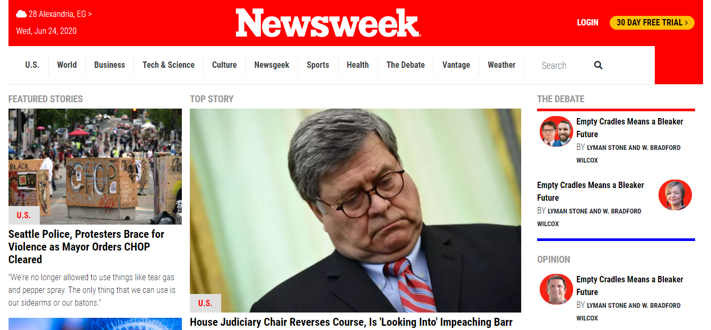

# Newsweek-Clone-Page
This is a clone of the Newsweek website

**This is a clone of The Next Web website**

## Built With

- HTML
- CSS3

[Live Demo Link](https://rawcdn.githack.com/MahmoudBakr23/Newsweek-Clone-Page/a9c2ff676a96838987bea138f6963f6938370312/index.html)

## Getting Started

**1) Clone this Github repository.**

## Authors

👤 **Mahmoud Bakr**

- Github: [@MahmoudBakr23](https://github.com/MahmoudBakr23)
- LinkedIn: [Mahmoud Bakr](https://www.linkedin.com/in/mahmoud-bakr-a76323194/)
- Gmail: mbakr6821@gmail.com

👤 **Mark Rode**

- Github: [@m15e](https://github.com/m15e)
- LinkedIn: [Mark Rode](https://www.linkedin.com/in/m15e)

## 🤝 Contributing

Contributions, issues and feature requests are welcome!

## Show your support

Give a ⭐️ if you like this project!
